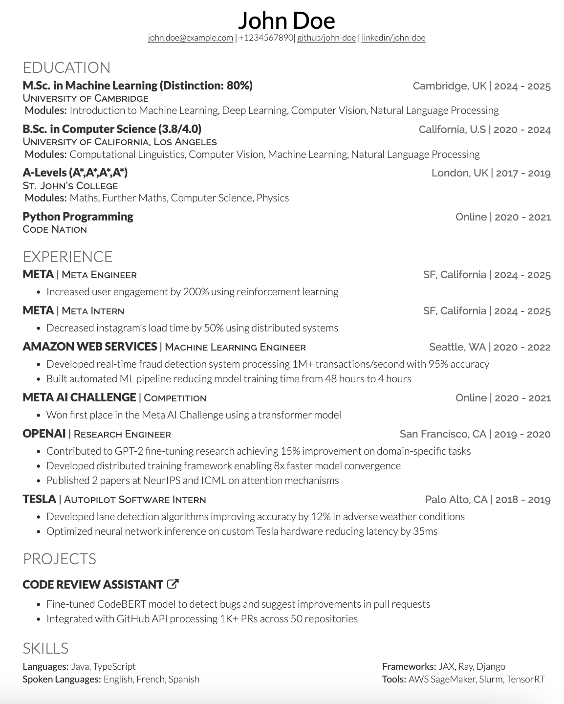

# Resume curator

This repository sets out to make resume curation easier.

Example output:




## Data ingestion (input)

### Candidate data

The candidate's experiences will be populated in the `candidate_data/` directory as JSON files.

There are 4 such files:

- `candidate_data/experiences.json` (candidate's work experience)
- `candidate_data/education.json` (candidate's education)
- `candidate_data/projects.json` (candidate's personal projects)
- `candidate_data/metadata.json` (candidate's name, other personal data, extracurriculars)

### Job description

Job descriptions to create cvs for are located in the `job_descriptions/` directory.

There are "parsed" job descriptions that are json format, and raw job descriptions (`.txt`). Parsed jsons are located in `job_descriptions/parsed` and raw descriptions are in `job_descriptions/raw`.

The example `meta_engineer.json` can be edited (including the filename) to adhere to the candidates desired output cv. The filename will dictate the output filename of the generated cv.

## Output

The program will parse the data sources in order to generate a `n` page resume (default is 1 page) in the desired output format (defualt is `LateX`).

## Usage

### Setup

0. Create your `.env` file by copying over the `.env.example` and filling in the values.

1. Create a virtual environment and install the requirements:

```bash
python3 -m venv .venv
source .venv/bin/activate  # On Windows: .venv\Scripts\activate
pip install -r requirements.txt
```

### Generating a Resume

2. **Parse the job description**: Place your raw job description text file in `job_descriptions/raw/` (e.g., `job_descriptions/raw/meta_engineer.txt`), then run:

```bash
python3 job-description-parser/main.py --raw-file \
 job_descriptions/raw/meta_engineer.txt
```

This will generate a parsed JSON file in `job_descriptions/parsed/` with the same name (e.g., `meta_engineer.json`).

> **Tip**: Use `--help` to see additional optional arguments.

3. **Generate the resume**: Using the parsed JSON from step 2, run:

**Option a (JSON output with LLM optimization):**

```bash
python3 resume-curator/main.py \
  --job-description job_descriptions/parsed/meta_engineer.json \
  --candidate-data candidate_data \
  --page-limit 1 \
  --output-format json
```

**Option b (JSON output without LLM):**

```bash
python3 resume-curator/main.py \
  --job-description job_descriptions/parsed/meta_engineer.json \
  --candidate-data candidate_data \
  --page-limit 1 \
  --output-format json \
  --no-llm
```

**Option c (LaTeX output with template):**

```bash
python3 resume-curator/main.py \
  --job-description job_descriptions/parsed/meta_engineer.json \
  --candidate-data candidate_data \
  --page-limit 1 \
  --output-format latex \
  --template-name bengt \
  --no-llm
```

> **Note**: When using `--output-format latex`, you **must** specify a template name using `--template-name`. Available templates are located in `resume-curator/templates/latex/`. Currently available: `bengt`, `deedy`.

Replace `meta_engineer.json` with your parsed job description filename from step 2.

After running the curator, the output resume will be found in the `resumes/` directory. The filename will match the job title from the parsed job description.

## Using LaTeX Output with Overleaf

When generating a LaTeX resume, the output `.tex` file (e.g., `resumes/latex/meta_engineer.tex`) needs to be uploaded to Overleaf along with the template's custom fonts and styling files. Simply uploading the `.tex` file alone won't work because it depends on custom document classes, fonts, and formatting definitions included in the template.

### Supported Templates

The current version supports **two LaTeX templates**:
- **bengt** - Modern, clean design
- **deedy** - Professional, structured layout

### Why Upload the Full Template?

LaTeX templates often use:
- Custom document classes (e.g., `resume-openfont.cls`)
- Special fonts (e.g., Lato, Raleway)
- Custom formatting macros and commands
- Styling files and packages

Your generated resume file references these dependencies, so you need to provide them in your Overleaf project.

### Steps to Upload to Overleaf

1. **Locate the template zip file**: All template zip files are conveniently located in `resumes/latex/template_zips/`. Choose the zip file matching your template:
   - For **bengt** template: `resumes/latex/template_zips/bengt.zip`
   - For **deedy** template: `resumes/latex/template_zips/deedy.zip`

2. **Upload the zip file to Overleaf**:

   a. Create a new project or open an existing one in Overleaf:

   

   b. Select "Upload Project" and choose the zip file:

   

3. **Replace the template's resume.tex file**: After the project is uploaded, locate the `resume.tex` file in your Overleaf project and replace its contents with your generated resume from `resumes/latex/Software Engineer, Machine Learning.tex`:

   

4. **Compile**: Click "Recompile" in Overleaf to generate your PDF resume with all fonts and styling properly applied.
